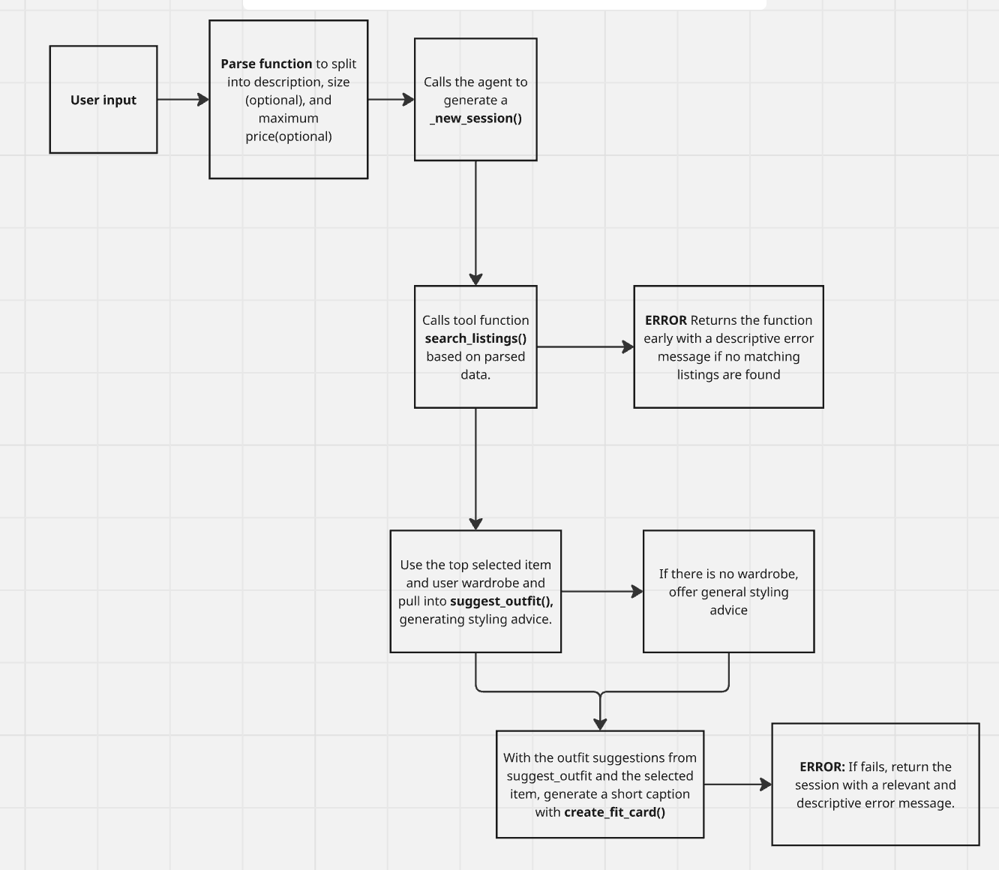

# FitFindr — Starter Kit

This starter kit contains everything you need to begin Project 2.

## What's Included

```
ai201-project2-fitfindr-starter/
├── data/
│   ├── listings.json          # 40 mock secondhand listings
│   └── wardrobe_schema.json   # Wardrobe format + example wardrobe
├── utils/
│   └── data_loader.py         # Helper functions for loading the data
├── planning.md                # Your planning template — fill this out first
└── requirements.txt           # Python dependencies
```

## Setup

```bash
pip install -r requirements.txt
```

Set your Groq API key in a `.env` file (get a free key at [console.groq.com](https://console.groq.com)):
```
GROQ_API_KEY=your_key_here
```

## The Mock Listings Dataset

`data/listings.json` contains 40 mock secondhand listings across categories (tops, bottoms, outerwear, shoes, accessories) and styles (vintage, y2k, grunge, cottagecore, streetwear, and more).

Each listing has: `id`, `title`, `description`, `category`, `style_tags`, `size`, `condition`, `price`, `colors`, `brand`, and `platform`.

Load it with:
```python
from utils.data_loader import load_listings
listings = load_listings()
```

## The Wardrobe Schema

`data/wardrobe_schema.json` defines the format your agent uses to represent a user's existing wardrobe. It includes:

- `schema`: field definitions for a wardrobe item
- `example_wardrobe`: a sample wardrobe with 10 items you can use for testing
- `empty_wardrobe`: a starting template for a new user

Load an example wardrobe with:
```python
from utils.data_loader import get_example_wardrobe
wardrobe = get_example_wardrobe()
```

## Where to Start

1. **Read `planning.md` and fill it out before writing any code.**
2. Verify the data loads correctly by running `python utils/data_loader.py`.
3. Build and test each tool individually before connecting them through your planning loop.

Your implementation files go in this same directory. There's no required file structure for your agent code — organize it however makes sense for your design.

## Tools

List every tool your agent will use. For each tool, fill in all four fields.
You must have at least 3 tools. The three required tools are listed — add any additional tools below them.

### Tool 1: search_listings

**What it does:**
<!-- Describe what this tool does in 1–2 sentences -->
`search_listings(decription, size, max_price)` searches in the listings.json dataset to search for items matching the description, optional size, and optional price ceiling.

**Input parameters:**
<!-- List each parameter, its type, and what it represents -->
- `description` (str): keywords that describe what the user is looking for
- `size` (str): ... optional filter to sort clothes by preferred size (`None` to skip)
- `max_price` (float): optional filter to filter out clothes that exceed the maximum price. (`None` to skip)


**What it returns:**
Returns a list of matching listing dicts, sorted by relevance
**What happens if it fails or returns nothing:**
<!-- What should the agent do if no listings match? -->
If the function fails or returns nothing, return `_new_session()` interaction early.
---

### Tool 2: suggest_outfit

**What it does:**
Given an input item and the user's wardrobe, suggest 1-2 complete outfits. 

**Input parameters:**
<!-- List each parameter, its type, and what it represents -->
- `new_item` (dict): The item the user is considering to buy.
- `wardrobe` (dict): A dict with an 'items' key containing a list of item dicts. (may be empty)

**What it returns:**
A non-empty string with outfit suggestions. If empty, offers general styling advice.

**What happens if it fails or returns nothing:**
If empty, the system should prompt to share general styling advice for the item instead of raising an exception or empty string. 

---

### Tool 3: create_fit_card

**What it does:**
Generates a short caption for the outfit including the thrifted find. 

**Input parameters:**
<!-- List each parameter, its type, and what it represents -->
- `outfit` (str): The outfit suggestion from `suggest_outfit(new_item, wardrobe)`
- `new_item` (dict): The listing dict for the thrifted item.

**What it returns:**
A 2-4 sentence string that is written to be sharable for social media platforms such as Instagram/Tiktok. 

**What happens if it fails or returns nothing:**
If the outfit is empty or missing, return a descriptive error message string. The code should not raise an exception.

---

### Additional Tools (if any)

<!-- Copy the block above for any tools beyond the required three -->

---

## Planning Loop

**How does your agent decide which tool to call next?**
The session is generated through the `_new_session()` function. Then after parsing the user query, extracting description, size, and max_price, call search_listings(). If there is results in `session["search_results"]`, then select the top item to move into calling `suggest_outfit()` then returning the output of `create_fit_card()` with the outfit suggestion. 

The agent always follows the order of creating a new session, searching listings, suggesting outfits, then creating fit cards chronologically. When an error is raised, the session will end abruptly.  

---

## State Management

**How does information from one tool get passed to the next?**
Information is stored in the session object generated by `_new_session`, including information about the query, the parsed query, search_results, the selected item, the wardrobe, the outfit_suggestion, the fit_card, and any error messages. The default values are always None (other than query and wardrobe, which are our parpameters) to help the system be sure to only call the relevant functions if the relevant parameters can be pulled from the session object. 

---

## Error Handling

For each tool, describe the specific failure mode you're handling and what the agent does in response.

| Tool | Failure mode | Agent response |
|------|-------------|----------------|
| search_listings | No results match the query | Raise an error by storing an error message in `session["error"]` and stop the session early with the generated error message. |
| suggest_outfit | Wardrobe is empty | Generate a prompt with general styling advice for the considered item. |
| create_fit_card | Outfit input is missing or incomplete | Return a descriptive error message, stored in `session["error"]` |

```
(.venv) PS C:\Users\anthony\Documents\ai201\ai201-project2-fitfindr-starter> python -c "from tools import search_listings; print(search_listings('designer ballgown', size='XXS', max_price=5))"
[]
```
```
(.venv) PS C:\Users\anthony\Documents\ai201\ai201-project2-fitfindr-starter> python -c "
>> from tools import search_listings, suggest_outfit
>> from utils.data_loader import get_example_wardrobe, get_empty_wardrobe
>> results = search_listings('vintage graphic tee', size=None, max_price=50)
>> print(suggest_outfit(results[0], get_empty_wardrobe()))
>> "
Considering you don't have any existing wardrobe items to pair with the Y2K Baby Tee, let's start from scratch. Here are two styling suggestions:

1. **Casual Chic**: Pair the baby tee with high-waisted jeans or a flowy skirt, and add some chunky sneakers or sandals for a relaxed, everyday look. Add a trendy tote bag and layered necklaces for a cute, laid-back vibe.
2. **Retro Revival**: Create a nostalgic outfit by combining the tee with low-rise pants or a mini skirt, and slip-on sneakers or platform sandals. Accessorize with a choker necklace, a scrunchie, or a bucket hat to complete the early 2000s-inspired aesthetic.

Both styles will work well with the butterfly print tee, and you can always mix and match pieces to create your own unique look. Since you're starting from scratch, feel free to experiment and add your own personal touches!
```
```
(.venv) PS C:\Users\anthony\Documents\ai201\ai201-project2-fitfindr-starter> python -c "
>> from tools import search_listings, create_fit_card
>> results = search_listings('vintage graphic tee', size=None, max_price=50)
>> print(create_fit_card('', results[0]))
>> "
Outfit is empty or not provided.
```
---

## Architecture

<!-- Draw a diagram of your agent showing how the components connect:
     User input → Planning Loop → Tools (search_listings, suggest_outfit, create_fit_card)
                                                                          ↕
                                                                   State / Session
     Show what triggers each tool, how state flows between them, and where error paths branch off.
     ASCII art, a Mermaid diagram (https://mermaid.js.org/syntax/flowchart.html), or an embedded
     sketch are all fine. You'll share this diagram with an AI tool when asking it to implement
     the planning loop and each individual tool. -->

---



## AI Tool Plan

<!-- For each part of the implementation below, describe:
     - Which AI tool you plan to use (Claude, Copilot, ChatGPT, etc.)
     - What you'll give it as input (which sections of this planning.md, your agent diagram)
     - What you expect it to produce
     - How you'll verify the output matches your spec before moving on

     "I'll use AI to help me code" is not a plan.
     "I'll give Claude my Tool 1 spec (inputs, return value, failure mode) and ask it to implement
     search_listings() using load_listings() from the data loader — then test it against 3 queries
     before trusting it" is a plan. -->

**Milestone 3 — Individual tool implementations:**
I am going to give ChatGPT my search_listings spec and ask it to help implement search_listings(). Then I am going to test this by writing my own queries and some of the example queries found in `app.py`. For suggest_outfit() and create_card_fit() I will ask ChatGPT to help implement these functions, using the context of of the function descriptions from `planning.md`. I will test these by using the example queries and write edge cases to test raised errors.

**Milestone 4 — Planning loop and state management:**
I am going to give ChatGPT my related notes in `planning.md` to help improve this section. Additionally, I am giving the AI this loop and the steps written in `agent.py` to help generate code. For example, I plan on asking ChatGPT to help write the parsing to build the related regex expressions to help filter the keywords from the query into the description, then to the . I will use the sample example queries in `app.py` to help test. I will also use additional test cases to test edge cases for this function. 

---

## Spec Reflection

<!-- Reflect on how planning.md shaped your implementation.
     Answer both questions with at least 2–3 sentences each. -->

**One way the spec helped you during implementation:**
The spec helped with developing unit tests and overall how to use pytest. I've worked with unit testing before, but never with Python, so it was a useful reminder and the provided test cases helped make sure my tools.py functions worked. I also asked ChatGPT to develop additional unit tests to ensure error cases work.

**One way your implementation diverged from the spec, and why:**
I changed the prompt for suggest_outfit() to be more explicitly clear that the user did not provide any outfits to pair with styling. I did this to make demoing the project more specific and easier to recognize that the test case of not providing a wardrobe then providing a general styling guide works.  


---

## AI Usage

<!-- Describe at least 2 specific instances where you used an AI tool during this project.
     For each: what did you give the AI as input, what did it produce, and what did you
     change, override, or direct differently?

     "I used Claude to help me code" is not sufficient.
     "I gave Claude my Chunking Strategy section from planning.md and asked it to implement
     chunk_text(). It returned a function using a fixed character split. I overrode the
     chunk size from 500 to 200 because my documents are short reviews, not long guides." -->

**Instance 1**

- *What I gave the AI:* I asked ChatGPT to write a function to parse my query using regex into the description, optional size, and optional price functions.
- *What it produced:* parse_query() function that utilizes regex expressions to split the query into a list of keyword strings for the description, and size and price variables. If no size or price exists, the respective variable is set to None.
- *What I changed or overrode:* I followed up by giving ChatGPT the data/listings.json file to ensure I'm not missing any indicators for size and price variables, such as oversized added alongside XS/S/M/L/XL sizes. This meant I edited the regex to better fit the provided data.

**Instance 2**

- *What I gave the AI:* I asked ChatGPT to develop the scoring and soritng operations for search_listings(), ensuring the highest matching is listing[0] to send to suggest_outfit().
- *What it produced:* The function was updated to generate a string with the description, price, and size for each listing and was compared against the query, utilizing a set intersection to score.
- *What I changed or overrode:* I added other parts of the listing, such as the title, category, brand, style_tags, and color to make the search more reliable. I did this to ensure no other relevant keywords are missing from the user's query, making the searching more comprehensive. 
